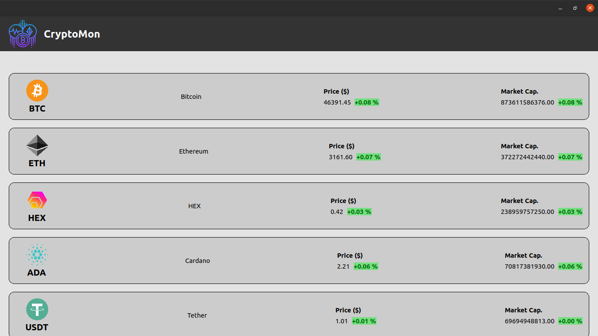
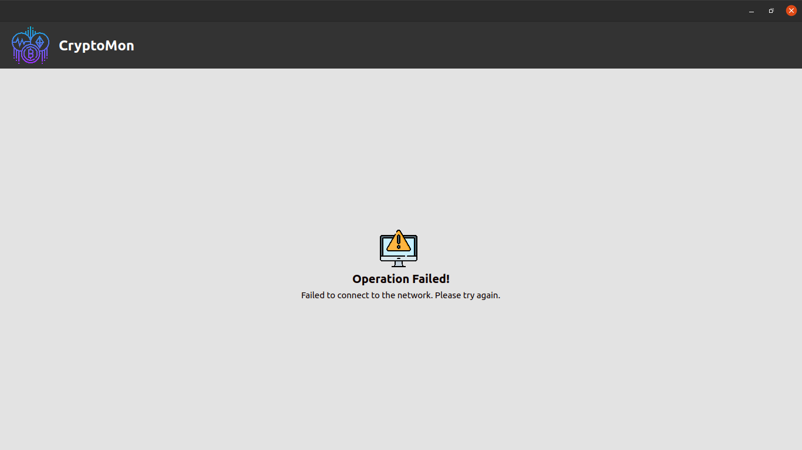
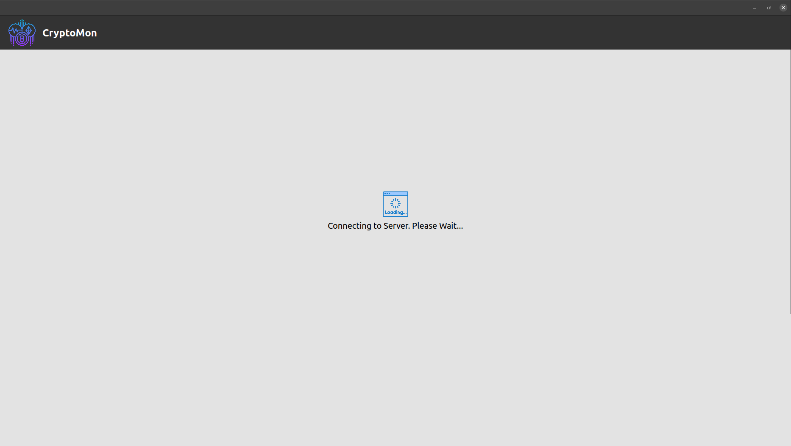

### CryptoMon

A Linux desktop application built with [Proton Native](https://proton-native.js.org/#/) to monitor the top 10 CryptoCurrencies ranked by market cap.

##### Status :

Under early-stage development and is filled with bugs. The readme will be updated once the project is stabilized.

### Screenshots:

- **Price and Marketcap Change Tracking Dashboard**
  

---

- **Error View**
  

---

- **Loading View**
  
