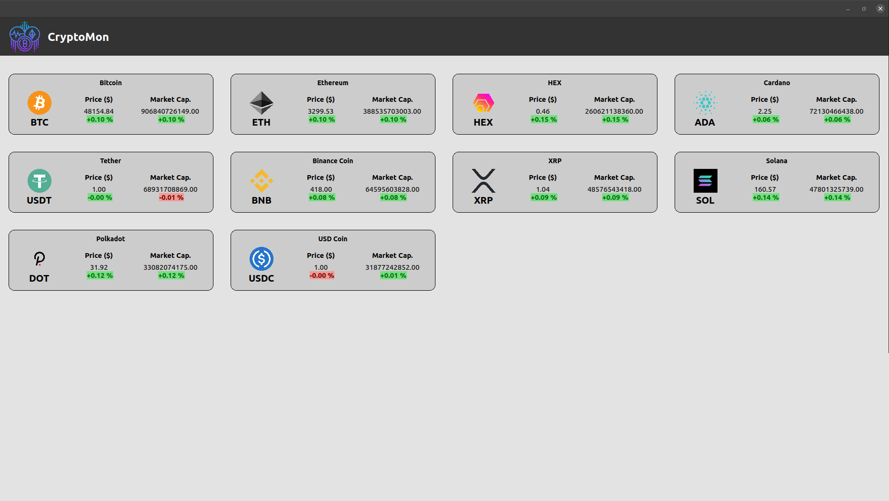

### CryptoMon

A Linux desktop application built with [Proton Native](https://proton-native.js.org/#/) to monitor the top 10 CryptoCurrencies ranked by market cap.

##### ⚠⚠ Warning ⚠ ⚠ :

**⚠This is not a Production-ready application⚠**

This is a quick proof of concept and doesn't follow certain best practices in terms of API consumption. Please use it at your own risk.

### Screenshots:

- **Price and Marketcap Change Tracking Dashboard**
  

---

- **Error View**
  

---

- **Loading View**
  


### Environment Variables:
The following env variables need to be setup on your machine for the app to fetch data from the server.

``` bash
CRYPTOMON_API_BASE=<nomics-api-server-base-url>
CRYPTOMON_API_VERSION=<api-version> (e.g: v1, this could be skipped and the app defaults to v1)
CRYPTOMON_API_KEY=<nomics-api-key>
```

***⚠ Please read the nomics api's terms and conditions before using their endpoints***

### Steps to Run Locally:
- clone this repo.
- `cd` into the directory.
- `npm i`
- add the required env variables to your system *(⚠ you'll need to register for an API key with nomics to make this app work)*
- `npm run dev`

### Attributions:
All the icons and images used here attributed to their respective owners.